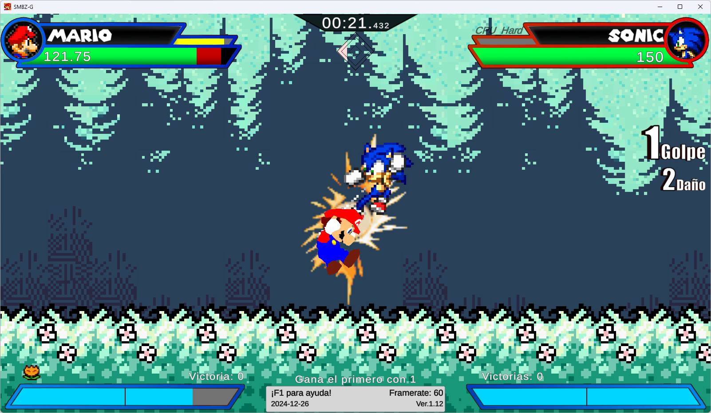

# sm64-in-smbz

Mod for [SMBZ-G](https://sites.google.com/view/smbz-g) which replaces Mario with SM64 Mario.

Requirements:
* [MelonLoader](https://github.com/LavaGang/MelonLoader/releases/latest)
* Super Mario 64 US ROM, with the filename "sm64.z64"

